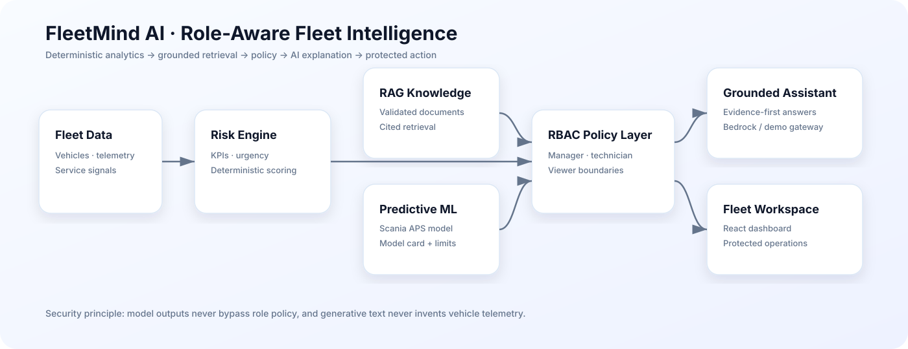

<div align="center">

# FleetMind AI

### Role-aware fleet intelligence with grounded AI, predictive maintenance & security

**Deterministic analytics · RAG · predictive ML · RBAC · FastAPI · React · AWS-ready architecture**


</div>

FleetMind AI is a portfolio-grade fleet-operations platform that combines **explainable fleet analytics, grounded role-scoped assistants, predictive-maintenance ML, governance evidence and cloud architecture** in one responsive workspace.

The project is explicit about data boundaries: fictional fleet telemetry is never presented as real vehicle data, while the predictive-maintenance model is trained and evaluated separately on the official Scania APS dataset.

## Architecture



Core reasoning path:

```text
fleet data → deterministic analytics → retrieved knowledge → role policy → AI explanation
```

Vehicle facts, risk ranking and service urgency are computed before any generative explanation is produced.

## Product capabilities

| Capability | Implementation |
|---|---|
| Fleet intelligence | Deterministic KPIs and composite risk scoring |
| Role-scoped AI | Manager, technician and viewer assistants |
| RAG | Validated ingestion, chunking, retrieval and cited context |
| Fleet command | Health, battery, location, service urgency and ranked risk |
| Maintenance agent | Deterministic triage and auditable mock ticket creation |
| Predictive ML | Reproducible Scania APS classifier with held-out metrics |
| Explainability | Score, threshold distance, outcome and explicit feature limits |
| Security | RBAC enforced at API boundaries |
| Governance | Manager-only usage analytics and runtime readiness |
| Cloud path | Bedrock, Cognito, DynamoDB, Lambda, API Gateway, S3, CloudFront, CDK |

## Role model

| Role | Workspace | Main access |
|---|---|---|
| Fleet manager | Manager Intelligence | KPIs, priorities, governance, assistant management |
| Technician | Technician Assistant | Diagnostics, predictive ML, technical knowledge |
| Viewer | Viewer Assistant | Read-only fleet status and explanations |

## Predictive-maintenance model

The bundled model is a calibrated histogram-gradient-boosting classifier trained from the UCI **APS Failure at Scania Trucks** dataset.

Held-out evaluation on 16,000 rows reports approximately:

- **Recall:** 93.07%
- **Precision:** 53.94%
- **Asymmetric cost reduction:** 91.48% versus an all-negative baseline

The model uses 170 anonymized features and predicts APS-related failure only. It does **not** score the fictional vehicles displayed in Fleet Command and is not validated for safety-critical production decisions.

See `docs/MODEL_CARD.md` for methodology and limitations.

## Grounded AI workflow

1. The backend reads authenticated fleet data.
2. FleetMind computes KPIs and risk scores deterministically.
3. The authenticated role selects the allowed assistant scope.
4. Approved retrieved knowledge and verified analytics are injected into model context.
5. The LLM explains evidence rather than inventing telemetry.
6. Operational actions remain protected by RBAC even if the UI is bypassed.

## API surface

```text
GET  /health
POST /api/auth/login
GET  /api/auth/me
GET  /api/fleet/intelligence
POST /api/chat/message
POST /api/agents/run
GET  /api/admin/usage
GET  /api/admin/readiness
GET  /api/ml/model-card
POST /api/ml/predict
```

## Quick start

```bash
docker compose up --build
```

Open:

- Web app: `http://localhost:5173`
- API docs: `http://localhost:8000/docs`
- Health: `http://localhost:8000/health`

Demo credentials are fictional and must not be reused outside the local demonstration.

## Repository layout

```text
backend/             FastAPI, auth, RBAC, analytics, RAG, agents, ML, tests
frontend/            React + TypeScript role-aware workspace
cdk/                 AWS infrastructure as code
examples/            assistant configs and sample knowledge
docs/                architecture, API guide, model card, release notes
compose.yaml         local multi-service demo
vercel.json          Vercel routing
.github/workflows/   CI
```

## Engineering quality

```bash
cd backend
poetry run ruff check app tests scripts
poetry run mypy app
poetry run pytest

cd ../frontend
npm run build

cd ../cdk
npm run build
npm run synth
```

## Portfolio status

The repository is complete for portfolio use and demonstrates **AI engineering, ML, backend/frontend development, security, cloud architecture and MLOps-quality evidence** without pretending to be a production fleet-control system.

A real deployment would still require validated telemetry ingestion, enterprise adapters, production observability, secrets management, load testing, domain validation and safety review.

## Author

Developed and maintained by **Chaima Menouar**.
