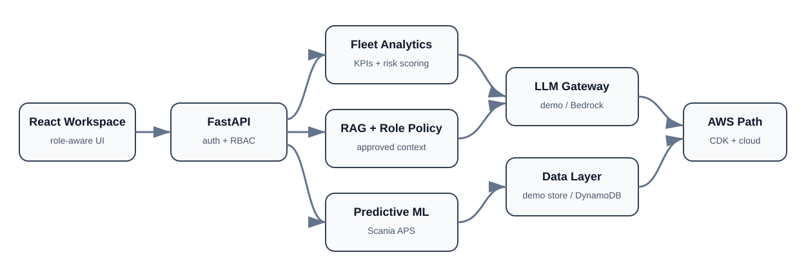

# FleetMind AI

FleetMind AI is a role-aware AI and cloud fleet-operations platform built as a portfolio-grade engineering project. It combines deterministic fleet analytics, grounded assistants, predictive-maintenance ML, RBAC, governance evidence, and an AWS deployment path in one responsive workspace.

The project is explicit about data boundaries: fictional fleet telemetry is never presented as real vehicle data, while the predictive-maintenance classifier is trained and evaluated separately on the official Scania APS dataset.

## Architecture



The core response path is:

```text
fleet data -> deterministic analytics -> retrieved knowledge -> role policy -> LLM explanation
```

Vehicle facts, risk scores, and service urgency are computed before any generative explanation is produced.

## Core capabilities

| Capability | Implementation |
|---|---|
| Grounded fleet intelligence | Deterministic KPI and composite risk scoring |
| Role-scoped AI | Manager, technician, and viewer assistants |
| RAG foundation | Validated ingestion, chunking, retrieval, and cited context |
| Fleet command | Health, battery, location, service urgency, ranked risk |
| Maintenance agent | Telemetry lookup, deterministic triage, auditable mock ticket creation |
| Predictive ML | Reproducible Scania APS classifier with held-out metrics |
| Explainability | Score, threshold distance, outcome, scope, explicit feature limits |
| Security | RBAC enforced at API boundaries |
| Governance | Manager-only usage analytics and runtime readiness |
| Cloud path | Bedrock, Cognito, DynamoDB, Lambda, API Gateway, S3, CloudFront, CDK |
| CI | Backend, frontend, and infrastructure checks |

## Role model

| Role | Assistant | Main access |
|---|---|---|
| Fleet manager | Manager Intelligence | KPIs, priorities, governance, assistant management |
| Technician | Technician Assistant | Maintenance diagnostics, predictive ML, technical knowledge |
| Viewer | Viewer Assistant | Read-only fleet status and explanations |

## Quick start

```bash
docker compose up --build
```

Open:

- Web app: `http://localhost:5173`
- API docs: `http://localhost:8000/docs`
- Health: `http://localhost:8000/health`

Demo credentials in the repository are fictional and must not be reused outside the local demonstration.

## Predictive-maintenance model

The bundled model is a calibrated histogram gradient boosting classifier trained from the UCI **APS Failure at Scania Trucks** dataset.

Held-out evaluation on 16,000 rows reports approximately:

- recall: **93.07%**
- precision: **53.94%**
- asymmetric cost reduction: **91.48%** versus an all-negative baseline

The model uses 170 anonymized features and predicts APS-related failure only. It does **not** score the fictional vehicles displayed in Fleet Command and is not validated for safety-critical production decisions.

See `docs/MODEL_CARD.md` for methodology and limitations.

## Grounded AI workflow

1. The backend reads authenticated fleet data.
2. FleetMind computes KPIs and risk scores deterministically.
3. The authenticated role selects the allowed assistant scope.
4. Approved retrieved knowledge and verified analytics are injected into model context.
5. The LLM explains evidence rather than inventing telemetry.
6. Operational actions remain protected by RBAC even if the UI is bypassed.

## API surface

| Method | Path | Purpose |
|---|---|---|
| GET | `/health` | Service status |
| POST | `/api/auth/login` | Sign in |
| GET | `/api/auth/me` | Current user |
| GET | `/api/fleet/intelligence` | KPIs and risk ranking |
| POST | `/api/chat/message` | Role-scoped grounded assistant |
| POST | `/api/agents/run` | Maintenance triage |
| GET | `/api/admin/usage` | Manager usage analytics |
| GET | `/api/admin/readiness` | Runtime evidence |
| GET | `/api/ml/model-card` | Model metadata and limitations |
| POST | `/api/ml/predict` | APS sample inference |

## Repository layout

```text
backend/             FastAPI, auth, RBAC, analytics, RAG, agents, ML, tests
frontend/            React + TypeScript role-aware workspace
cdk/                 AWS infrastructure as code
examples/            assistant configs and sample knowledge
docs/                architecture, API guide, model card, release notes
compose.yaml         local multi-service demo
vercel.json          Vercel routing
.github/workflows/   CI
```

## Quality checks

```bash
cd backend
poetry run ruff check app tests scripts
poetry run mypy app
poetry run pytest

cd ../frontend
npm run build

cd ../cdk
npm run build
npm run synth
```

## Cloud path

FleetMind can use a deterministic demo gateway or Amazon Bedrock. AWS credentials follow the normal SDK credential chain and must never be committed. The repository also contains an optional Cognito viewer-registration path and CDK infrastructure for the broader AWS architecture.

## Portfolio release status

This repository is complete for portfolio use and demonstrates AI engineering, ML, cloud architecture, backend/frontend development, security, and MLOps-quality evidence without pretending to be a production fleet-control system.

A real enterprise deployment would still require validated telemetry ingestion, persistent enterprise adapters, production observability, secrets management, load testing, domain validation, and safety review.

## Author

Developed and maintained by **Chaima Menouar**.
